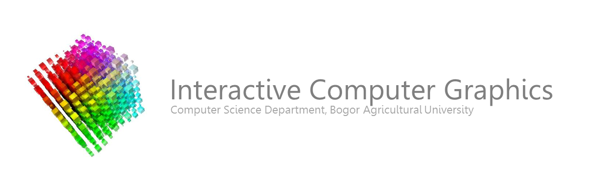

# KOM301 Grafika Komputer

Repositori GitHub ini menyimpan seluruh materi praktikum termasuk kode sumber yang digunakan di praktikum. 

# Pengajar
- Auzi Asfarian (Koordinator)
- Hendra Rahmawan
- Shelvie Nidya Neyman
- Muhammad Asyhar Agmalaro

# Asisten
- Muhammad Iqbal Shiddiq (Sesi Senin)
- Nadya Farchana Fidaroina (Sesi Senin)
- Iyang Aneka Wibowo (Sesi Rabu)
- Rheisa Gusmendasari (Sesi Rabu)

# Silabus
[UTS](https://github.com/auziasfarian/CG-IPB/tree/master/01.%20GLFW)

1. Pengenalan dan Instalasi GLFW
2. Window, Sistem Koordinat, dan Objek Dua Dimensi
3. Transformasi Dua Dimensi
4. Interaksi (mouse dan keyboard)
5. Objek Tiga Dimensi dan Transformasi Tiga Dimensi
6. Tekstur dan Pencahayaan
7. Presentasi Tugas GLFW

[UAS](https://github.com/auziasfarian/CG-IPB/tree/master/02.%20Unity)

1. Pengenalan dan Instalasi Unity
2. Case Studies buat Game #1
3. Case Studies buat Game #2
4. Case Studies buat Aplikasi AR
5. Case Studies buat Aplikasi VR
6. Project Kelompok
7. Presentasi Tugas Unity
=======
UTS
1. [Pengenalan dan Instalasi GLFW](https://github.com/auziasfarian/CG-IPB/tree/master/01.%20GLFW/Pertemuan%2001)
2. [Window, Sistem Koordinat, dan Objek Dua Dimensi](https://github.com/auziasfarian/CG-IPB/tree/master/01.%20GLFW/Pertemuan%2002)
3. [Transformasi Dua Dimensi](https://github.com/auziasfarian/CG-IPB/tree/master/01.%20GLFW/Pertemuan%2003)
4. [Interaksi (mouse dan keyboard)](https://github.com/auziasfarian/CG-IPB/tree/master/01.%20GLFW/Pertemuan%2004)
5. [Objek Tiga Dimensi dan Transformasi Tiga Dimensi](https://github.com/auziasfarian/CG-IPB/tree/master/01.%20GLFW/Pertemuan%2005)
6. [Tekstur dan Pencahayaan](https://github.com/auziasfarian/CG-IPB/tree/master/01.%20GLFW/Pertemuan%2006)
7. [Presentasi Tugas GLFW](https://github.com/auziasfarian/CG-IPB/tree/master/01.%20GLFW/Pertemuan%2007)

UAS
1. [Pengenalan dan Instalasi Unity](https://github.com/auziasfarian/CG-IPB/tree/master/02.%20Unity/Pertemuan%2008)
2. [Case Studies buat Game #1](https://github.com/auziasfarian/CG-IPB/tree/master/02.%20Unity/Pertemuan%2009)
3. [Case Studies buat Game #2](https://github.com/auziasfarian/CG-IPB/tree/master/02.%20Unity/Pertemuan%2010)
4. [Case Studies buat Aplikasi AR](https://github.com/auziasfarian/CG-IPB/tree/master/02.%20Unity/Pertemuan%2011)
5. [Case Studies buat Aplikasi VR](https://github.com/auziasfarian/CG-IPB/tree/master/02.%20Unity/Pertemuan%2012)
6. [Project Kelompok](https://github.com/auziasfarian/CG-IPB/tree/master/02.%20Unity/Pertemuan%2013)
7. [Presentasi Tugas Unity](https://github.com/auziasfarian/CG-IPB/tree/master/02.%20Unity/Pertemuan%2014)
>>>>>>> 51abad2da8c6dad92e9cebe1505ba6e143758fad

# TUGAS
## Tugas Nama (Deadline Pertemuan 5)
- Membuat nama panggilan dari masing-masing dengan menggunakan objek dua dimensi dan memanfaatkan transformasi dua dimensi dan interaksi. Tugas bersifat perseorangan. Nama minimal terdiri atas 5 karakter.
- Penilaian: seberapa mahir mahasiswa dalam menggunakan objek dua dimensi, transformasi, dan interaksi.
- Syarat untuk mendapatkan A (nilai tugas = 80): jenis objek 2D yang digunakan > 5, untuk setiap jenis transformasi (dilasi, rotasi, skalasi) minimal satu kali digunakan, ada interaksi menggunakan _mouse_ atau _keyboard_. Selebihnya nilai diambil dari kualitas pengerjaan (keindahan dan kompleksitas).

## Tugas Rumah (Deadline Pertemuan 7)
- Membuat desain rumah impian di masa depan kalian dengan menggunakan objek tiga dimensi dan memanfaatkan transformasi dan interaksi. Tugas bersifat perseorangan. 
- Penilaian: seberapa mahir mahasiswa dalam menggunakan objek tiga dimensi, transformasi, dan interaksi.
- Syarat untuk mendapatkan A (nilai tugas = 80): jenis objek 3D yang digunakan > 5, untuk setiap jenis transformasi (dilasi, rotasi, skalasi) minimal satu kali digunakan, ada interaksi menggunakan _mouse_ atau _keyboard_. Selebihnya nilai diambil dari kualitas pengerjaan (keindahan dan kompleksitas).

## Tugas Project Unity: Membuat Game Sederhana (Deadline Pertemuan 11)
- Membuat game sederhana dengan menggunakan Unity3D. Dapat mengikuti tutorial yang tersedia di internet, asal dimodifikasi. Tugas berkelompok maksimal tiga orang.
- Penilaian: seberapa mahir mahasiswa menggunakan teknik-teknik grafika komputer dalam membuat aplikasi grafika komputer berjenis game.

## Tugas Project Unity (Deadline Pertemuan 14)
- Mengembangkan aplikasi _mixed reality_ sederhana dengan menggunakan _framework_. 
- Penilaian: seberapa mahir mahasiswa menggunakan teknik-teknik grafika komputer dalam membuat aplikasi grafika komputer berjenis _mixed reality_.
